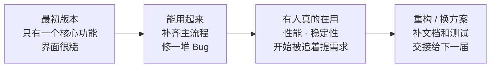

<div class="h-full flex flex-col justify-center">

<h1 class="deck-title color-[var(--slidev-theme-primary)]! text-5xl! leading-tight! mb-2">From <span class="relative inline-block font-extrabold">Coding<svg class="absolute left-0 w-full h-[0.13em] pointer-events-none" style="bottom: -0.04em" viewBox="0 0 100 8" preserveAspectRatio="none" aria-hidden="true"><path d="M1 4.7 C20 3.5, 39 5.7, 59 4.4 S83 3.7, 99 4.6" fill="none" stroke="#13acd9" stroke-width="1.8" stroke-linecap="round"/><path d="M2 6 C24 4.9, 46 6.2, 68 5.3 S88 5, 98 5.5" fill="none" stroke="#13acd9" stroke-width="0.9" stroke-linecap="round" opacity="0.55"/></svg></span><br/>to <span class="relative inline-block font-extrabold">Software Engineering<svg class="absolute left-0 w-full h-[0.13em] pointer-events-none" style="bottom: -0.04em" viewBox="0 0 100 8" preserveAspectRatio="none" aria-hidden="true"><path d="M1 4.7 C20 3.5, 39 5.7, 59 4.4 S83 3.7, 99 4.6" fill="none" stroke="#13acd9" stroke-width="1.8" stroke-linecap="round"/><path d="M2 6 C24 4.9, 46 6.2, 68 5.3 S88 5, 98 5.5" fill="none" stroke="#13acd9" stroke-width="0.9" stroke-linecap="round" opacity="0.55"/></svg></span></h1>

<div class="w-16 h-1 bg-[var(--slidev-theme-primary)] rounded-full opacity-60 mb-3"></div>

<div class="mb-8 font-sans text-[13px] font-bold tracking-[0.12em] leading-none color-[var(--slidev-theme-primary)]!">{{ new Date().getFullYear() }}年{{ new Date().getMonth() + 1 }}月{{ new Date().getDate() }}日</div>

<div class="flex items-start gap-4 text-[11px] leading-none opacity-80">

<div class="flex flex-col gap-1.5">
<span class="text-[9px] tracking-[0.16em] opacity-70 font-semibold">PRESENTER</span>
<div class="flex items-center gap-1.5 pr-3 rounded-full bg-white/50 ring-1 ring-gray-300/40">

<span>袁梓涵</span>
<span class="opacity-40">yuanzihan</span>
</div>
</div>

<div class="flex flex-col gap-1.5">
<span class="text-[9px] tracking-[0.16em] opacity-0">PRESENTER</span>
<div class="flex items-center gap-1.5 pr-3 rounded-full bg-white/50 ring-1 ring-gray-300/40">

<span>李承恩</span>
<span class="opacity-40">Isy</span>
</div>
</div>

<div class="flex flex-col gap-1.5">
<span class="text-[9px] tracking-[0.16em] opacity-0">PRESENTER</span>
<div class="flex items-center gap-1.5 pr-3 rounded-full bg-white/50 ring-1 ring-gray-300/40">

<span>张宸铭</span>
<span class="opacity-40">shiyudesu</span>
</div>
</div>

<div class="flex flex-col gap-1.5">
<span class="text-[9px] tracking-[0.16em] opacity-70 font-semibold">SLIDES</span>
<div class="flex items-center gap-1.5 pr-3 rounded-full bg-white/50 ring-1 ring-gray-300/40">

<span>李厚之</span>
<span class="opacity-40">Elecmonkey</span>
</div>
</div>

</div>

<div class="mt-10 text-sm leading-none">
<div class="flex items-center gap-2 color-[var(--slidev-theme-primary)]!">

<div class="flex items-baseline gap-2.5">
<span class="font-sans font-bold">信使计划工作室</span><span>Herald Studio</span>
</div>
</div>
</div>

</div>

---
layout: two-cols-header
---

# 课程中的 Coding

::left::

```cpp
void bubbleSort(vector<int>& nums) {
    int n = nums.size();
    for (int i = 0; i < n - 1; ++i) {
        bool swapped = false;
        for (int j = 0; j < n - i - 1; ++j) {
            if (nums[j] > nums[j + 1]) {
                swap(nums[j], nums[j + 1]);
                swapped = true;
            }
        }
        if (!swapped) break;
    }
}
```

::right::

<div class="pl-4">

<div class="flex items-center gap-2 mb-3">
<div class="w-1.5 h-1.5 rounded-full bg-gray-400"></div>
<span class="text-sm">算法题、课程实验、小组项目，形式都很常见</span>
</div>

<div class="flex items-center gap-2 mb-3">
<div class="w-1.5 h-1.5 rounded-full bg-gray-400"></div>
<span class="text-sm">老师给出验收标准和截止日期</span>
</div>

<div class="flex items-center gap-2 mb-3">
<div class="w-1.5 h-1.5 rounded-full bg-gray-400"></div>
<span class="text-sm">交付通常是代码、报告或一次课堂演示</span>
</div>

<div class="flex items-center gap-2 mb-3">
<div class="w-1.5 h-1.5 rounded-full bg-gray-400"></div>
<span class="text-sm">很少部署给真实用户持续使用</span>
</div>

<div class="flex items-center gap-2">
<div class="w-1.5 h-1.5 rounded-full bg-gray-400"></div>
<span class="text-sm">课程结束后，代码通常也停在那一版</span>
</div>

</div>

---
layout: default
---

# 可是，真实的软件工程流程是……

<div class="grid grid-cols-[1.15fr_0.85fr] gap-6 mt-6">

<div class="grid grid-cols-2 gap-3">

<div v-click class="p-3 rounded-lg border border-gray-200 bg-white/65">
<div class="text-xs font-bold color-[var(--slidev-theme-primary)]! mb-1">01 · 技术选型</div>
<div class="text-xs opacity-75">语言、框架、数据库和部署方式怎么选。</div>
</div>

<div v-click class="p-3 rounded-lg border border-gray-200 bg-white/65">
<div class="text-xs font-bold color-[var(--slidev-theme-primary)]! mb-1">02 · 系统设计</div>
<div class="text-xs opacity-75">模块怎么拆，接口、数据和权限怎么组织。</div>
</div>

<div v-click class="p-3 rounded-lg border border-gray-200 bg-white/65">
<div class="text-xs font-bold color-[var(--slidev-theme-primary)]! mb-1">03 · 编码与协作</div>
<div class="text-xs opacity-75">Git、代码规范、评审，以及前后端联调。</div>
</div>

<div v-click class="p-3 rounded-lg border border-gray-200 bg-white/65">
<div class="text-xs font-bold color-[var(--slidev-theme-primary)]! mb-1">04 · 测试与排障</div>
<div class="text-xs opacity-75">测试、日志、性能，以及异常和边界情况。</div>
</div>

<div v-click class="p-3 rounded-lg border border-gray-200 bg-white/65">
<div class="text-xs font-bold color-[var(--slidev-theme-primary)]! mb-1">05 · 部署与运行</div>
<div class="text-xs opacity-75">构建、环境配置、容器、监控和备份。</div>
</div>

<div v-click class="p-3 rounded-lg border border-gray-200 bg-white/65">
<div class="text-xs font-bold color-[var(--slidev-theme-primary)]! mb-1">06 · 迭代与维护</div>
<div class="text-xs opacity-75">修 Bug、升级依赖、重构和兼容历史数据。</div>
</div>

</div>

<div v-click class="flex flex-col justify-center">

<div class="mt-2 text-center text-xs opacity-55">心理中心咨询系统</div>
</div>

</div>

<div v-click class="mt-6 p-3 rounded-lg bg-[#13acd9]/8 border border-[#13acd9]/25 text-center text-sm font-medium">
到了真实项目里，我们大部分时间在处理这些问题，几乎不会手写冒泡排序。
</div>

---

# 项目是一版一版改出来的

<div class="mt-5 text-sm opacity-65">
技术方案、代码和上线后的运行情况，都要根据真实使用继续调整。
</div>

<div class="mt-6">



</div>

<div class="grid grid-cols-2 gap-6 mt-8">

<div v-click class="p-4 rounded-lg bg-gray-50">

**第一版只做了最核心的功能**

很多细节还没处理，
先拿来测试，再根据问题继续改。

</div>

<div v-click class="p-4 rounded-lg bg-gray-50">

**后面的版本逐步补齐**

功能、性能、文档和交接，
都是在使用过程中加进去的。

</div>

</div>

---
layout: default
---

# 你会遇到……

<div class="text-sm opacity-60 mt-1 mb-6">从课堂走到真实项目，容易在这几件事上栽跟头</div>

<div class="grid grid-cols-2 gap-4">

<div v-click class="p-4 rounded-lg bg-white border border-gray-200 border-l-4 border-l-[var(--slidev-theme-primary)] shadow-sm">
<div class="text-sm font-bold mb-1.5">技术选型没有后悔药</div>
<div class="text-xs leading-relaxed opacity-70">早期图省事随手定的数据结构和表结构，扛不住业务越长越复杂，回头改就是牵一发动全身。</div>
</div>

<div v-click class="p-4 rounded-lg bg-white border border-gray-200 border-l-4 border-l-[var(--slidev-theme-primary)] shadow-sm">
<div class="text-sm font-bold mb-1.5">Bug 可能藏在全链路的任何一环</div>
<div class="text-xs leading-relaxed opacity-70">前端、接口、数据库、部署环境都可能是源头，排查复现靠的是系统性的知识储备，而不是应付某一门课的知识点。</div>
</div>

<div v-click class="p-4 rounded-lg bg-white border border-gray-200 border-l-4 border-l-[var(--slidev-theme-primary)] shadow-sm">
<div class="text-sm font-bold mb-1.5">本地能跑，不代表线上能用</div>
<div class="text-xs leading-relaxed opacity-70">配置、网络、依赖版本，本地和线上总有些地方不一样，环境差异才是真正的隐患。</div>
</div>

<div v-click class="p-4 rounded-lg bg-white border border-gray-200 border-l-4 border-l-[var(--slidev-theme-primary)] shadow-sm">
<div class="text-sm font-bold mb-1.5">团队协作本身也是工程的一部分</div>
<div class="text-xs leading-relaxed opacity-70">分支冲突、接口没对齐、进度不同步——项目一旦做大，写代码往往不是最难的那部分。</div>
</div>

</div>

<div v-click class="mt-6 text-center text-sm opacity-60">
课上很少讲这些，大多要自己经历一次才会真正记住
</div>

---

# 课堂代码和真实开发，差在哪？

<div class="text-sm opacity-60 mt-1 mb-12">起点差不多，但终点完全不是一回事</div>

<div v-click>

<div class="text-xs font-bold opacity-45 tracking-wide mb-3">课程作业</div>

<div class="flex items-center flex-wrap gap-x-2 gap-y-2 text-sm">
<span class="opacity-55">需求</span>
<span class="opacity-30">→</span>
<span class="opacity-55">编码</span>
<span class="opacity-30">→</span>
<span class="font-bold px-3 py-1 rounded-full bg-gray-100">验收提交</span>
</div>

</div>

<div v-click class="mt-10">

<div class="text-xs font-bold opacity-45 tracking-wide mb-3">真实开发</div>

<div class="flex items-center flex-wrap gap-x-2 gap-y-2 text-sm">
<span class="opacity-55">开发</span>
<span class="opacity-30">→</span>
<span class="opacity-55">部署上线</span>
<span class="opacity-30">→</span>
<span class="font-bold px-3 py-1 rounded-full bg-[#13acd9]/10 color-[var(--slidev-theme-primary)]!">用户使用不可控</span>
<span class="opacity-30">→</span>
<span class="opacity-55">异常 · 性能 · 安全</span>
<span class="opacity-30">→</span>
<span class="opacity-55">持续迭代</span>
<span class="opacity-30">→</span>
<span class="opacity-35 tracking-widest">……</span>
</div>

</div>

<div v-click class="mt-14 text-center text-base font-medium">
一个交完就算结束，一个从上线那天才真正开始
</div>

---
layout: default
---

# 软件工程专业课

<div class="relative h-[400px] mt-12">

<div v-click class="absolute left-[8%] top-2 w-[42%] min-h-[290px] p-6 rounded-xl border border-t-4 shadow-md" style="transform: rotate(-3.5deg); background: color-mix(in srgb, var(--slidev-theme-primary) 6%, white); border-color: color-mix(in srgb, var(--slidev-theme-primary) 26%, white); border-top-color: color-mix(in srgb, var(--slidev-theme-primary) 68%, white)">
<div class="text-sm font-bold mb-3 color-[var(--slidev-theme-primary)]! opacity-68">01</div>
<div class="text-2xl font-bold mb-4">数据结构与算法</div>
<div class="text-base leading-relaxed opacity-75">数据结构决定数据怎样组织和访问。算法训练让你能判断时间和空间开销，遇到性能问题时知道从哪里查。</div>
</div>

<div v-click class="absolute right-[8%] top-8 w-[42%] min-h-[290px] p-6 rounded-xl border border-t-4 shadow-md" style="transform: rotate(3deg); background: color-mix(in srgb, var(--slidev-theme-primary) 11%, white); border-color: color-mix(in srgb, var(--slidev-theme-primary) 36%, white); border-top-color: color-mix(in srgb, var(--slidev-theme-primary) 85%, white)">
<div class="text-sm font-bold mb-3 color-[var(--slidev-theme-primary)]! opacity-85">02</div>
<div class="text-2xl font-bold mb-4">软件工程导论</div>
<div class="text-base leading-relaxed opacity-75">课程会讲需求、设计、测试、版本管理和协作流程。团队项目做久了，就会知道这些步骤分别在解决什么问题。</div>
</div>

</div>

---
layout: default
---

# 软件工程专业课

<div class="relative h-[400px] mt-12">

<div v-click class="absolute left-[8%] top-6 w-[42%] min-h-[290px] p-6 rounded-xl border border-t-4 shadow-md" style="transform: rotate(3.5deg); background: color-mix(in srgb, var(--slidev-theme-primary) 8%, white); border-color: color-mix(in srgb, var(--slidev-theme-primary) 30%, white); border-top-color: color-mix(in srgb, var(--slidev-theme-primary) 75%, white)">
<div class="text-sm font-bold mb-3 color-[var(--slidev-theme-primary)]! opacity-75">03</div>
<div class="text-2xl font-bold mb-4">操作系统</div>
<div class="text-base leading-relaxed opacity-75">程序最后都要交给操作系统运行。进程、线程、内存和 I/O，是排查并发、资源占用和性能问题的基础。</div>
</div>

<div v-click class="absolute right-[8%] top-2 w-[42%] min-h-[290px] p-6 rounded-xl border border-t-4 shadow-md" style="transform: rotate(-3deg); background: color-mix(in srgb, var(--slidev-theme-primary) 12%, white); border-color: color-mix(in srgb, var(--slidev-theme-primary) 38%, white); border-top-color: color-mix(in srgb, var(--slidev-theme-primary) 88%, white)">
<div class="text-sm font-bold mb-3 color-[var(--slidev-theme-primary)]! opacity-88">04</div>
<div class="text-2xl font-bold mb-4">计算机网络</div>
<div class="text-base leading-relaxed opacity-75">请求怎样从浏览器到服务器，连接为什么超时，代理和 HTTPS 在做什么。前后端联调、部署和线上排查都会用到。</div>
</div>

</div>

---
layout: default
---

# 软件工程专业课

<div class="relative h-[400px] mt-12">

<div v-click class="absolute left-[8%] top-2 w-[42%] min-h-[290px] p-6 rounded-xl border border-t-4 shadow-md" style="transform: rotate(-4deg); background: color-mix(in srgb, var(--slidev-theme-primary) 5%, white); border-color: color-mix(in srgb, var(--slidev-theme-primary) 24%, white); border-top-color: color-mix(in srgb, var(--slidev-theme-primary) 65%, white)">
<div class="text-sm font-bold mb-3 color-[var(--slidev-theme-primary)]! opacity-65">05</div>
<div class="text-2xl font-bold mb-4">数据库</div>
<div class="text-base leading-relaxed opacity-75">表结构、索引和事务决定数据能否存对、查快。数据量和并发上来后，早期设计的问题会很快暴露。</div>
</div>

<div v-click class="absolute right-[8%] top-6 w-[42%] min-h-[290px] p-6 rounded-xl border border-t-4 shadow-md" style="transform: rotate(2.5deg); background: color-mix(in srgb, var(--slidev-theme-primary) 9%, white); border-color: color-mix(in srgb, var(--slidev-theme-primary) 32%, white); border-top-color: color-mix(in srgb, var(--slidev-theme-primary) 78%, white)">
<div class="text-sm font-bold mb-3 color-[var(--slidev-theme-primary)]! opacity-78">06</div>
<div class="text-2xl font-bold mb-4">编译原理</div>
<div class="text-base leading-relaxed opacity-75">普通业务开发很少直接用到，准备一直写常规业务代码，60 分及格就够。想做语言、工具链或编辑器，它是很重要的基础，这些方向也更难被 AI 替代。</div>
</div>

</div>

---
layout: two-cols-header
---

# AI 确实很好用

::left::

<div class="text-xs opacity-50 mb-3">现在的 AI 能承担的软件开发工作</div>

<div class="grid grid-cols-2 gap-2">

<div class="px-3 py-2 rounded-lg bg-gray-50 text-sm text-center">编写 CRUD</div>
<div class="px-3 py-2 rounded-lg bg-gray-50 text-sm text-center">编写前端组件</div>
<div class="px-3 py-2 rounded-lg bg-gray-50 text-sm text-center">生成 SQL</div>
<div class="px-3 py-2 rounded-lg bg-gray-50 text-sm text-center">补充测试</div>
<div class="px-3 py-2 rounded-lg bg-gray-50 text-sm text-center">解释代码</div>
<div class="px-3 py-2 rounded-lg bg-gray-50 text-sm text-center">查询 API</div>
<div class="px-3 py-2 rounded-lg bg-gray-50 text-sm text-center">代码迁移</div>
<div class="px-3 py-2 rounded-lg bg-gray-50 text-sm text-center">重构</div>
<div class="px-3 py-2 rounded-lg bg-gray-50 text-sm text-center">定位 Bug</div>
<div class="px-3 py-2 rounded-lg bg-gray-50 text-sm text-center">编写脚本</div>
<div class="px-3 py-2 rounded-lg bg-gray-50 text-sm text-center">补充文档</div>
<div class="px-3 py-2 rounded-lg bg-[#13acd9]/8 border border-[#13acd9]/25 text-sm text-center font-medium">根据需求完成相对完整的功能</div>

</div>

<div class="mt-4 text-xs opacity-60">它已经不只是简单的代码补全工具</div>

::right::

<div class="pl-4">

<div class="mb-4 text-sm opacity-75">AI 带来的变化，不只是"代码写得更快"，更重要的是：</div>

<div class="p-4 rounded-lg bg-[#13acd9]/8 border border-[#13acd9]/25 text-center font-bold mb-5">
AI 放大了一个人的并行工作能力
</div>

<div class="text-xs opacity-50 mb-2">以前一次主要处理一件事，现在可以同时让 AI 做多项工作：</div>


<div class="flex items-center gap-2 mb-2">
<div class="w-1.5 h-1.5 rounded-full bg-gray-400"></div>
<span class="text-sm">一个 AI 帮忙分析 Bug</span>
</div>

<div class="flex items-center gap-2 mb-2">
<div class="w-1.5 h-1.5 rounded-full bg-gray-400"></div>
<span class="text-sm">一个 AI 帮忙查某个框架</span>
</div>

<div class="flex items-center gap-2 mb-2">
<div class="w-1.5 h-1.5 rounded-full bg-gray-400"></div>
<span class="text-sm">一个 AI 帮忙补测试</span>
</div>

<div class="flex items-center gap-2 mb-4">
<div class="w-1.5 h-1.5 rounded-full bg-gray-400"></div>
<span class="text-sm">自己同时思考整体设计和后续安排</span>
</div>


<div class="p-3 rounded-lg bg-teal-50 border border-teal-200 text-center text-sm font-medium">
AI 已经不只是代码补全工具，而是在逐渐成为软件工程师的协作者
</div>

</div>

---
layout: default
---

# Vibe Coding 之后

<div class="text-sm opacity-60 text-center mt-1 mb-6">AI 写代码，只是露出水面的那一小块</div>

<div class="relative flex flex-col items-center">

<div class="w-[42%] py-5 rounded-t-2xl text-center bg-white border border-gray-200 shadow-sm">
<div class="text-[10px] tracking-widest opacity-40 mb-1.5">看得见</div>
<div class="font-bold">AI 生成代码</div>
</div>

<div class="w-full max-w-[720px] relative border-t-2 border-dashed border-[#13acd9]/45">
<span class="absolute right-0 -top-2.5 text-[10px] tracking-[0.2em] opacity-35">WATERLINE</span>
</div>

<div class="w-[74%] py-10 rounded-b-[2rem] text-center bg-gradient-to-b from-[#13acd9]/10 to-[#13acd9]/30 border border-[#13acd9]/25 border-t-0">
<div class="text-[10px] tracking-widest opacity-45 mb-2">看不见，但更重要</div>
<div class="text-2xl font-bold color-[var(--slidev-theme-primary)]! tracking-wide">读懂 · 判断 · 验证 · 负责</div>
</div>

</div>

<div class="mt-8 text-center">
<div class="text-base font-medium">看得懂、测得出、改得动，才谈得上放心用</div>
<div class="mt-1.5 text-sm opacity-55">只知道"能跑"、说不清为什么这么写——控制权已经不在自己手里了</div>
</div>

---

# 在 AI Agent 帮助下提升

<div class="text-sm opacity-70 mt-2 mb-5">用 AI 的时候，别把方向盘也交出去。</div>

<div class="grid grid-cols-1 gap-3 mt-2">

<div class="flex items-center gap-4 p-3 rounded-lg bg-gray-50">
<div class="font-bold text-xl w-8 color-[var(--slidev-theme-primary)]!">01</div>
<div>
<span class="font-bold">先想清楚，再去问</span>
<span class="opacity-70 text-sm"> —— 心里先有个大概方案，再看 AI 给出的哪里不一样</span>
</div>
</div>

<div class="flex items-center gap-4 p-3 rounded-lg bg-gray-50">
<div class="font-bold text-xl w-8 color-[var(--slidev-theme-primary)]!">02</div>
<div>
<span class="font-bold">让 AI 也做一次审阅者</span>
<span class="opacity-70 text-sm"> —— 代码写完之后，反过来让它挑挑毛病</span>
</div>
</div>

<div class="flex items-center gap-4 p-3 rounded-lg bg-gray-50">
<div class="font-bold text-xl w-8 color-[var(--slidev-theme-primary)]!">03</div>
<div>
<span class="font-bold">别被它的"下一步建议"牵着走</span>
<span class="opacity-70 text-sm"> —— 时刻记得自己真正要解决的问题是什么</span>
</div>
</div>

<div class="flex items-center gap-4 p-3 rounded-lg bg-[#13acd9]/8 border border-[#13acd9]/25">
<div class="font-bold text-xl w-8 color-[var(--slidev-theme-primary)]!">04</div>
<div>
<span class="font-bold">该动手时，自己动手</span>
<span class="opacity-70 text-sm"> —— 哪怕改动很小，也保持对代码的手感</span>
</div>
</div>

</div>

<div class="mt-6 text-center text-sm font-medium">
AI 负责执行，方向和判断始终握在自己手里
</div>

---
layout: two-cols-header
---

# 如何用好 AI 工具

::left::

<div class="text-xs opacity-50 mb-2">拆好任务，再交给 AI</div>

<div class="grid grid-cols-1 gap-2 mt-2">

<div class="p-3 rounded-lg border border-gray-200">
<div class="text-sm font-bold mb-1">"帮我把头像功能完善一下"</div>
<div class="text-xs opacity-60">AI 只能自己猜边界，猜错了改起来更麻烦</div>
</div>

<div class="p-3 rounded-lg border-2 border-[#13acd9] bg-[#13acd9]/5">
<div class="text-sm font-bold mb-2">先拆成任务节点，再交给 AI</div>
<div class="text-xs opacity-75 leading-relaxed">
① 上传接口 ② 文件存储 ③ 数据库保存地址<br/>
④ 前端展示 ⑤ 异常处理
</div>
</div>

</div>

<div class="mt-4 text-sm text-center font-medium">
人维护任务树，AI 执行任务节点
</div>

::right::

<div class="pl-4">

<div class="text-xs opacity-50 mb-3">AI 写完代码以后</div>


<div class="flex items-center gap-2 mb-2.5">
<div class="w-6 text-center font-bold text-sm color-[var(--slidev-theme-primary)]!">读</div>
<span class="text-sm opacity-80">看懂它改了哪些文件、核心逻辑是什么</span>
</div>

<div class="flex items-center gap-2 mb-2.5">
<div class="w-6 text-center font-bold text-sm color-[var(--slidev-theme-primary)]!">问</div>
<span class="text-sm opacity-80">让它反过来做一次 Code Review，找风险和遗漏</span>
</div>

<div class="flex items-center gap-2 mb-2.5">
<div class="w-6 text-center font-bold text-sm color-[var(--slidev-theme-primary)]!">测</div>
<span class="text-sm opacity-80">不只测正常情况，也测空数据、异常和并发</span>
</div>

<div class="flex items-center gap-2 mb-2.5">
<div class="w-6 text-center font-bold text-sm color-[var(--slidev-theme-primary)]!">集成</div>
<span class="text-sm opacity-80">检查有没有影响其他模块、破坏旧接口</span>
</div>

<div class="flex items-center gap-2">
<div class="w-6 text-center font-bold text-sm color-[var(--slidev-theme-primary)]!">维护</div>
<span class="text-sm opacity-80">三个月后有没有人还能看懂、能不能快速回滚</span>
</div>


</div>

---

# 给同学们的几个建议

<div class="grid grid-cols-1 gap-3 mt-6">

<div v-click class="flex items-center gap-4 p-3 rounded-lg bg-gray-50">
<div class="text-teal-600 font-bold text-xl w-8">01</div>
<div>
<span class="font-bold">尽早完整地做一次软件开发</span>
<span class="opacity-70 text-sm"> —— 从需求到上线走通一遍，哪怕项目很小</span>
</div>
</div>

<div v-click class="flex items-center gap-4 p-3 rounded-lg bg-gray-50">
<div class="text-teal-600 font-bold text-xl w-8">02</div>
<div>
<span class="font-bold">多动手、多 Debug，不要只看教程</span>
<span class="opacity-70 text-sm"> —— 看完教程后，自己从头做一遍</span>
</div>
</div>

<div v-click class="flex items-center gap-4 p-3 rounded-lg bg-gray-50">
<div class="text-teal-600 font-bold text-xl w-8">03</div>
<div>
<span class="font-bold">学会 Git、查官方文档、自己定位问题</span>
<span class="opacity-70 text-sm"> —— 团队开发每天都会用到</span>
</div>
</div>

<div v-click class="flex items-center gap-4 p-3 rounded-lg bg-gray-50">
<div class="text-teal-600 font-bold text-xl w-8">04</div>
<div>
<span class="font-bold">有机会就多参加项目、比赛和团队开发</span>
<span class="opacity-70 text-sm"> —— 接触不同分工，也看看别人怎么写代码</span>
</div>
</div>

<div v-click class="flex items-center gap-4 p-3 rounded-lg bg-teal-50 border border-teal-200">
<div class="text-teal-600 font-bold text-xl w-8">05</div>
<div>
<span class="font-bold">攒下几个自己参与、能讲清楚的项目</span>
<span class="opacity-70 text-sm"> —— 找实习时，简历和面试都有具体内容可讲</span>
</div>
</div>

<div v-click class="flex items-center gap-4 p-3 rounded-lg bg-gray-50/50">
<div class="text-teal-600 font-bold text-xl w-8 opacity-50 line-through">06</div>
<div class="font-bold opacity-50 line-through">加入我们</div>
</div>

</div>

---
layout: default
---

# 我们在做这些

<div class="grid grid-cols-3 gap-3 mt-6">

<div v-click class="rounded-lg border border-gray-200 overflow-hidden">

<div class="p-3">
<div class="font-bold text-sm">心理中心咨询系统</div>
<div class="flex items-center gap-2 mt-2 opacity-80"><ReactIcon /><ViteIcon /><JavaIcon /><KotlinIcon /><SpringIcon /><MysqlIcon /></div>
</div>
</div>

<div v-click class="rounded-lg border border-gray-200 overflow-hidden">

<div class="p-3">
<div class="font-bold text-sm">学工部小程序</div>
<div class="flex items-center gap-2 mt-2 opacity-80"><VueIcon /><ViteIcon /><GoIcon /><NodeIcon /><OracleIcon /></div>
</div>
</div>

<div v-click class="rounded-lg border border-gray-200 overflow-hidden">

<div class="p-3">
<div class="font-bold text-sm">信息学院导师会客厅</div>
<div class="flex items-center gap-2 mt-2 opacity-80"><VueIcon /><RsbuildIcon /><JavaIcon /><SpringIcon /><MysqlIcon /></div>
</div>
</div>

<div v-click class="rounded-lg border border-gray-200 overflow-hidden">

<div class="p-3">
<div class="font-bold text-sm">学生处英文官网</div>
<div class="flex items-center gap-2 mt-2 opacity-80"><AstroIcon /><TailwindIcon /></div>
</div>
</div>

<div v-click class="rounded-lg border border-gray-200 overflow-hidden">
<div class="h-28 w-full overflow-hidden bg-gray-50">

</div>
<div class="p-3">
<div class="font-bold text-sm">党史国情知识竞赛</div>
<div class="flex items-center gap-2 mt-2 opacity-80"><VueIcon /><ViteIcon /><GoIcon /><MysqlIcon /></div>
</div>
</div>

<div v-click class="rounded-lg border-2 border-[#13acd9] bg-[#13acd9]/5 flex items-center justify-center p-4 text-center">
<div class="font-bold text-lg tracking-widest text-[#13acd9]">AND MORE…</div>
</div>

</div>

---
layout: default
---

# 你将接触到

<div class="grid grid-cols-6 gap-x-4 gap-y-5 mt-5">

<div v-click class="col-span-2">

<div class="mt-2 text-[15px] font-bold color-[var(--slidev-theme-primary)]!">AI Agent 开发</div>
</div>

<div v-click class="col-span-2">

<div class="mt-2 text-[15px] font-bold color-[var(--slidev-theme-primary)]!">企业级后端应用构建</div>
</div>

<div v-click class="col-span-2">

<div class="mt-2 text-[15px] font-bold color-[var(--slidev-theme-primary)]!">前沿前端工程</div>
</div>

<div v-click class="col-span-3">

<div class="mt-2 text-[15px] font-bold color-[var(--slidev-theme-primary)]!">高性能数据库设计</div>
</div>

<div v-click class="col-span-3">
<div class="grid gap-2" style="grid-template-columns: 1.35fr 1fr; height: 112px">


</div>
<div class="mt-3 text-[15px] leading-none font-bold color-[var(--slidev-theme-primary)]!">Linux 与 DevOps</div>
</div>

</div>

<div v-click class="mt-3 text-right text-xl font-extrabold tracking-[0.18em] color-[var(--slidev-theme-primary)]! opacity-75">AND MORE…</div>

---
layout: default
---

# 你还能得到……

<div class="relative h-[370px] mt-2">

<div class="absolute right-2 top-1 text-xs tracking-widest opacity-40">技术 · 项目 · 实习 · 工作</div>

<svg class="absolute inset-0 w-full h-full pointer-events-none" viewBox="0 0 900 370" aria-hidden="true">
  <path d="M430 175 C505 120, 535 225, 610 180" fill="none" stroke="var(--slidev-theme-primary)" stroke-width="2" stroke-dasharray="7 9" opacity="0.32" />
  <circle cx="444" cy="166" r="5" fill="var(--slidev-theme-primary)" opacity="0.32" />
  <circle cx="596" cy="188" r="5" fill="var(--slidev-theme-primary)" opacity="0.32" />
</svg>

<div v-click class="absolute left-2 top-4 w-[51%]" style="transform: rotate(-2deg)">

<div class="mt-3 ml-2">
<div class="text-2xl font-bold">技术沙龙</div>
<div class="w-16 h-1 bg-[var(--slidev-theme-primary)] opacity-55 mt-2 mb-3" style="transform: rotate(-2deg)"></div>
<div class="text-sm leading-relaxed opacity-65">在讨论与分享中最快的进步。</div>
</div>
</div>

<div v-click class="absolute right-1 top-20 w-[40%]" style="transform: rotate(2deg)">
<div class="text-3xl color-[var(--slidev-theme-primary)]! mb-2">✦</div>
<div class="text-2xl font-bold">最优秀的朋友</div>
<div class="w-16 h-1 bg-[var(--slidev-theme-primary)] opacity-55 mt-2 mb-3" style="transform: rotate(-2deg)"></div>
<div class="text-sm leading-relaxed opacity-65">
一起做项目、参加分享，平时也会交换想法、互相帮忙。
</div>
</div>

<div class="absolute right-10 bottom-2 w-3 h-3 rounded-full bg-amber-300 opacity-70"></div>
<div class="absolute right-20 bottom-8 w-2 h-2 rounded-full bg-teal-400 opacity-60"></div>

</div>

---
layout: default
---

<div class="grid grid-cols-2 h-full items-center gap-16">

<div class="text-center">
<h1 class="closing-title color-[var(--slidev-theme-primary)]! text-6xl!">Thanks</h1>

<div class="mt-8">
<div class="text-sm opacity-50 mb-3">访问招新官网</div>
<a href="https://myseu.cn" target="_blank" class="text-2xl font-semibold color-[var(--slidev-theme-primary)]!">myseu.cn</a>
</div>

<div class="mt-5">
<div class="text-xs opacity-50 mb-2">本 PPT 地址</div>
<a href="https://tommy-se.edev.uno" target="_blank" class="text-lg font-semibold color-[var(--slidev-theme-primary)]!">tommy-se.edev.uno</a>
</div>

<div class="mt-4">
<div class="text-xs opacity-50 mb-2">PPT 源码见</div>
<a href="https://github.com/elecmonkey/slidev-tommy-se" target="_blank" class="text-lg font-semibold color-[var(--slidev-theme-primary)]!">github.com/elecmonkey/slidev-tommy-se</a>
</div>
</div>

<div class="text-center">

<div class="mt-3 text-sm opacity-70">扫码加入招新 QQ 群</div>
</div>

</div>
